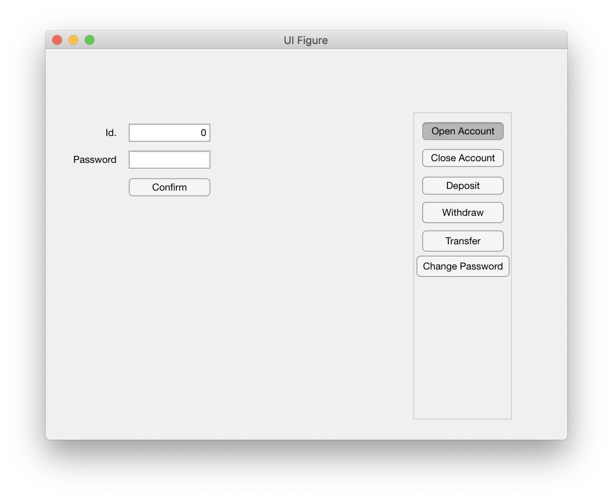
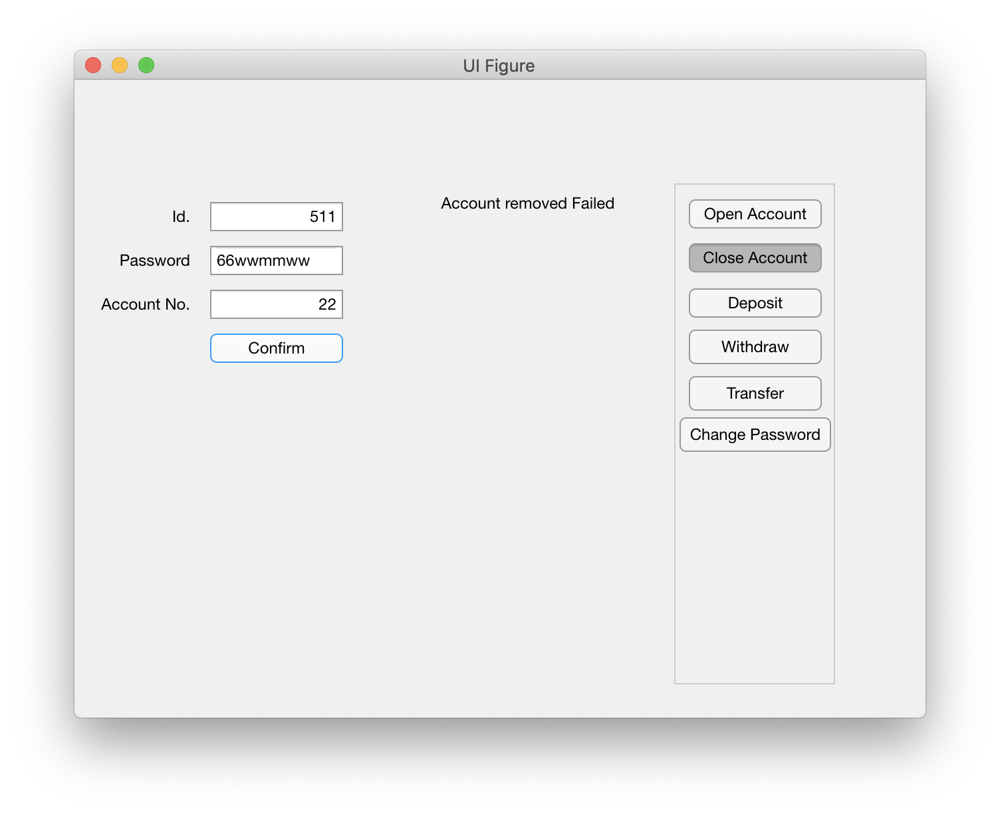
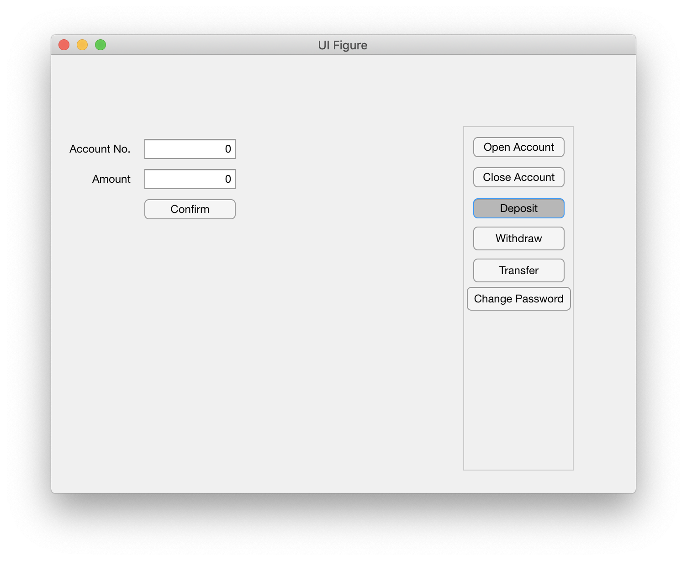
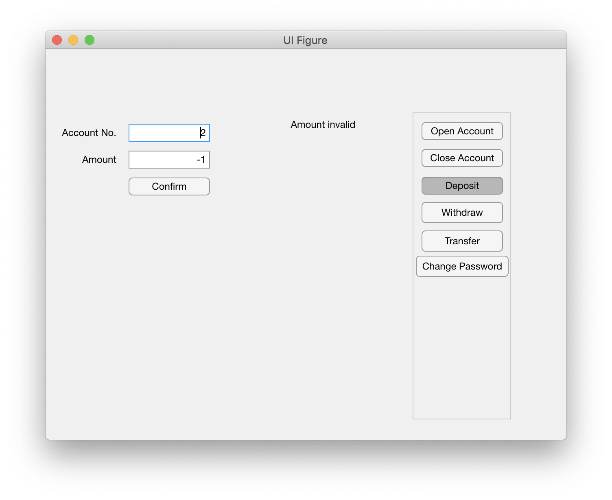
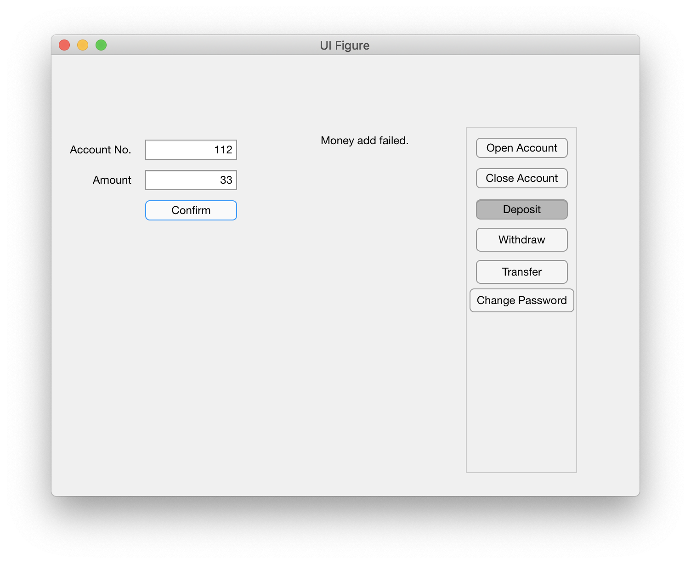
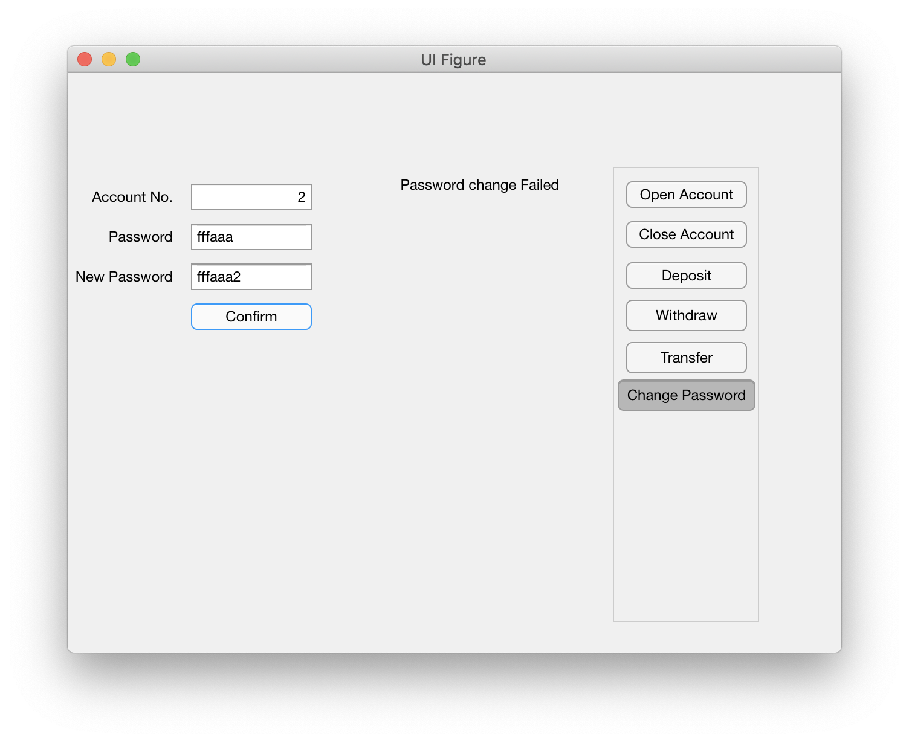

# Banking System 

This is the project for CS132 Software Engineering @ Shanghaitech.


# User manual

## How to run GUI

Run your matlab and change directory to `ui`. Run

```
hi_path
```

and this will prepare the PATH for the project.

Run `UI_Clerk_exported`, and then a window like the following will pop up. This GUI serves as the actions a clerk can take at the counter.



We will introduce how to use the system according to iteration phase specified in [Iteration plan](#iteration-plan).


## Iteration plan

Banking System 1.0 (can open account, close account and change password)

Banking System 1.1 (add deposit, withdraw and transfer)

Banking System 2.0 (add the ticket system, have a better user interface)

Banking System 3.0 release (add ATM system, can deposit/withdraw via ATM)


Banking System 3.1 (add the ticket system, have a better user interface)


## Iteration 0

**Open account**. It is the default choice. Input the *Identity numer* and the *password*, the system will open an account for the customer and the account will have a account number associated with it. Customer should remember this number as it will be the entry to perform further actions.


**Close account**. Input the *Identity numer*, the *password* and the *account number*. if they are verified, the customer can close account.


If any of three pieces of information is input wrongly, the removal will fail.




### Iteration 1

**Deposit**. You can input the *account number* and *the amount of money*.



If you input the account number correctly, you can top up money.


If you input invalidly, the procedure will fail, which can be caused by account that does not exist or negative amount.





**Change Password**. You need provide *account number, the old password* and *the new password* in order to change password.

If you input all the information correctly, you will have the feedback.


In other situations, it will fail.




