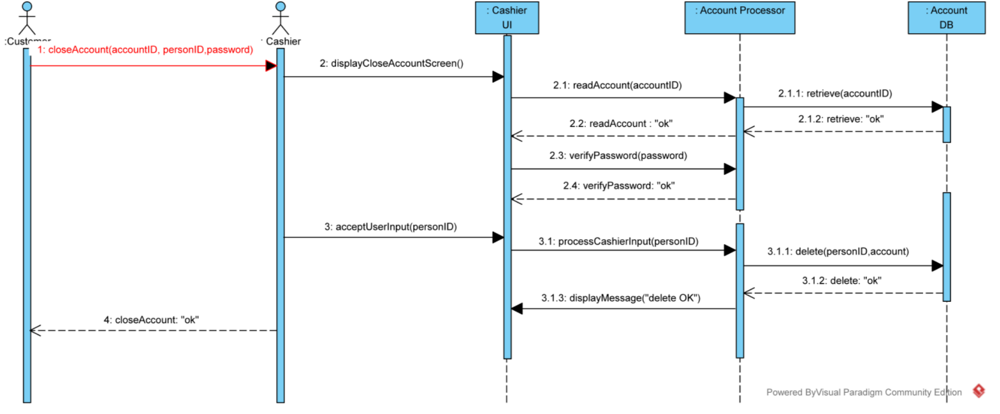

# Specification

This document will explain which part of Requirement document is implemented in the code.

**Open account**. The following image is the use case of the procedure open account, depicted in the requirement document. Here we only have the clerk UI so the process from the customer to the clerk is omitted.

| Seq No. in the use case | Counter part in implementation                 |
| ----------------------- | ---------------------------------------------- |
| 2                       | Click button `Open Account`                    |
| 3                       | Input at `Id.` and `Password` field            |
| 3.1.1~3.1.3             | Creation of account is performed in background |
| 3.1.4, 3.1.5            | The message at the center                      |
|                         |                                                |

**Close account**. The following image is the use case of the procedure close account, depicted in the requirement document. 

| Seq No. in the use case | Counter part in implementation                               |
| ----------------------- | ------------------------------------------------------------ |
| 2                       | Click button `Close Account`                                 |
| 2, 3                    | The process is simplified to input all information at once. Input person `identity number, password` and `account number`. |
| 3.1.3                   | The feedback is shown at the center.                         |

**Change password**.

| Seq No. in the use case | Counter part in implementation                               |
| ----------------------- | ------------------------------------------------------------ |
| 2                       | Click button `Change Passsword`                              |
| 2, 3                    | The process is simplified to input all information at once. Input person `account number`, password` and `new password`. |
| 3.1.3                   | The feedback is shown at the center.                         |

**Deposit**.

| Seq No. in the use case | Counter part in implementation                               |
| ----------------------- | ------------------------------------------------------------ |
| 2                       | Click button `Deposit`                                       |
| 2, 3                    | The process is simplified to input all information at once. Input person `account number`, `Amount`. |
| 3.1.3                   | The feedback is shown at the center.                         |

